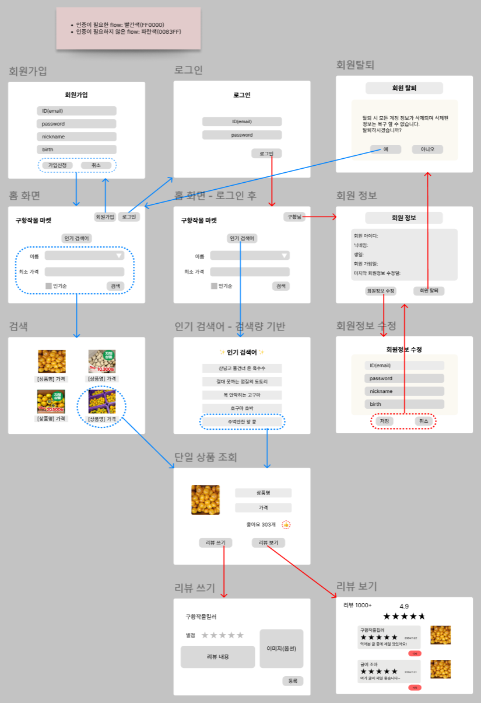
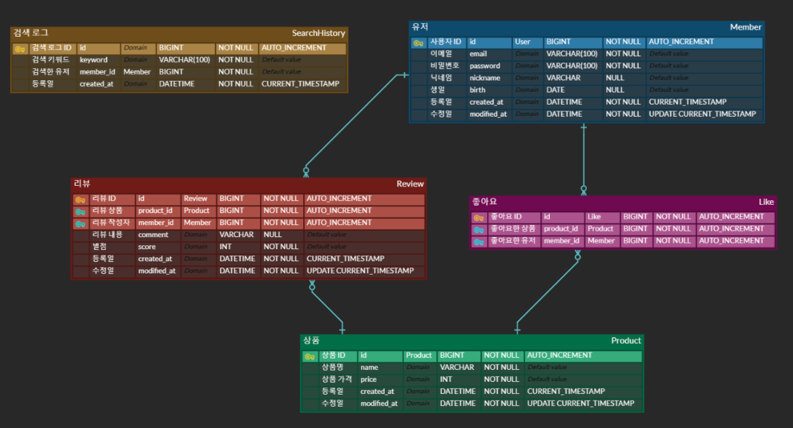

### 🖥️와이어 프레임


### 📋ERD


### 📑API 명세서
<details><summary><b>API 명세서(펼치기/접기)</b></summary>

<table>
    <tr>
        <th>api&nbsp;&nbsp;&nbsp;&nbsp;&nbsp;&nbsp;&nbsp;&nbsp;&nbsp;&nbsp;&nbsp;&nbsp;&nbsp;&nbsp;</th>
        <th>Method</th>
        <th>URL</th>
        <th>request header</th>
        <th>request</th>
        <th>response header</th>
        <th>response</th>                               
<th>status&nbsp;&nbsp;&nbsp;&nbsp;&nbsp;&nbsp;&nbsp;&nbsp;&nbsp;&nbsp;&nbsp;&nbsp;&nbsp;&nbsp;&nbsp;&nbsp;&nbsp;&nbsp;&nbsp;&nbsp;&nbsp;&nbsp;&nbsp;&nbsp;&nbsp;&nbsp;&nbsp;&nbsp;&nbsp;&nbsp;&nbsp;&nbsp;&nbsp;&nbsp;&nbsp;&nbsp;&nbsp;&nbsp;&nbsp;&nbsp;&nbsp;&nbsp;&nbsp;&nbsp;&nbsp;&nbsp;&nbsp;&nbsp;&nbsp;&nbsp;
        </th>
    </tr>
    <tr>
        <td><b>회원 가입</b></td>
        <td><span style=background-color:#786E12AA;font-weight:bold;>POST</span></td>
        <td><span>/api/auth/signup</span></td>
        <td><code>N/A</Code></td>
        <td><pre lang="json">{
    "email": "hong@email.com",
    "password": "1q2w3e4r#",
    "nickname": "홍길동",
    "birth": "2000-01-01"
}</pre></td>
        <td>201</td>
        <td><code>N/A</Code></td>
        <td>
            <span style=background-color:yellow;font-weight:bold;color:black;>201</span>: 성공<br/>
            <span style=background-color:skyblue;font-weight:bold;color:black;>400</span>: 잘못된 요청<br/>
            <span style=background-color:skyblue;font-weight:bold;color:black;>401</span>: 인증 실패
        </td>
    </tr>
    <tr>
        <td><b>로그인</b></td>
        <td><span style=background-color:#786E12AA;font-weight:bold;>POST</span></td>
        <td><span>/api/auth/signin</span></td>
        <td><code>N/A</Code></td>
        <td><code>N/A</Code></td>
        <td>
            <span>200</span></br>
            <span>JWT</span>
        </td>
        <td><code>N/A</Code></td>
        <td>
            <span style=background-color:yellow;font-weight:bold;color:black;>200</span>: 성공<br/>
            <span style=background-color:skyblue;font-weight:bold;color:black;>400</span>: 잘못된 요청<br/>
            <span style=background-color:skyblue;font-weight:bold;color:black;>401</span>: 인증 실패
        </td>
    </tr>
    <tr>
        <td><b>프로필<br/>조회</b></td>
        <td><span style=background-color:#22741CAA;font-weight:bold;>GET</span></td>
        <td><span>/api/user/profile</span></td>
        <td>Authorization</td>
        <td><code>N/A</code></td>
        <td>200</td>
        <td><pre lang="json">{
    "id": 1,
    "nickname": "닉네임",
    "birth": "2000-01-01",
    "createdAt": "2024-11-22 00:00:00",
    "modifedtAt": "2024-11-22 00:00:00"
}</pre></td>
        <td>
            <span style=background-color:yellow;font-weight:bold;color:black;>200</span>: 성공<br/>
            <span style=background-color:skyblue;font-weight:bold;color:black;>400</span>: 토큰이 없음<br/>
            <span style=background-color:skyblue;font-weight:bold;color:black;>401</span>: 인증 실패
        </td>
    </tr>
    <tr>
        <td><b>프로필<br/>수정</b></td>
        <td><span style=background-color:#3B36CFAA;font-weight:bold;>PUT</span></td>
        <td>/api/user/profile</td>
        <td>Authorization</td>
        <td><pre lang="json">{
    "password": "Admin123!",
    "nickname": "닉네임",
    "birth": "2000-01-01"
}</pre></td>
        <td>200</td>
        <td><pre lang="json">{
    "id": 1,
    "nickname": "닉네임",
    "birth": "2000-01-01",
    "createdAt": "2024-11-22 00:00:00",
    "modifedtAt": "2024-11-22 00:00:00"
}</pre></td>
        <td>
            <span style=background-color:yellow;font-weight:bold;color:black;>200</span>: 성공<br/>
            <span style=background-color:skyblue;font-weight:bold;color:black;>400</span>: 토큰이 없음<br/>
            <span style=background-color:skyblue;font-weight:bold;color:black;>401</span>: 인증 실패
        </td> 
    </tr>
    <tr>
        <td><b>회원 탈퇴</b></td>
        <td><span style=background-color:#CE3636AA;font-weight:bold;>DELETE</span></td>
        <td>/api/profile</td>
        <td>Authorization</td>
        <td><pre lang="json">{
    "password": "Admin123!"
}</pre></td>
        <td>204</td>
        <td><code>N/A</Code></td>
        <td>
            <span style=background-color:yellow;font-weight:bold;color:black;>204</span>: 성공<br/>
            <span style=background-color:skyblue;font-weight:bold;color:black;>400</span>: 토큰이 없음<br/>
            <span style=background-color:skyblue;font-weight:bold;color:black;>401</span>: 인증 실패
        </td> 
    </tr>
    <tr>
        <td><b>좋아요<br/>추가</b></td>
        <td><span style=background-color:#786E12AA;font-weight:bold;>POST</span></td>
        <td><span>/api/likes<br/>/{productId}</span></td>
        <td>Authorization</td>
        <td><pre lang="json">{
    "id": 1
}</pre></td>
        <td>201</td>
        <td><code>N/A</Code></td>
        <td>
            <span style=background-color:yellow;font-weight:bold;color:black;>201</span>: 성공<br/>
            <span style=background-color:skyblue;font-weight:bold;color:black;>400</span>: 토큰이 없음<br/>
            <span style=background-color:skyblue;font-weight:bold;color:black;>401</span>: 인가 실패<br/>
            <span style=background-color:skyblue;font-weight:bold;color:black;>400</span>: 중복된 좋아요
        </td> 
    </tr>
    <tr>
        <td><b>좋아요<br/>취소</b></td>
        <td><span style=background-color:#CE3636AA;font-weight:bold;>DELETE</span></td>
        <td><span>/api/likes<br/>/{productId}</span></td>
        <td>Authorization</td>
        <td><pre lang="json">{
    "id": 1
}</pre></td>
        <td>204</td>
        <td><code>N/A</Code></td>
        <td>
            <span style=background-color:yellow;font-weight:bold;color:black;>204</span>: 성공<br/>
            <span style=background-color:skyblue;font-weight:bold;color:black;>400</span>: 토큰이 없음<br/>
            <span style=background-color:skyblue;font-weight:bold;color:black;>401</span>: 인가 실패<br/>
            <span style=background-color:skyblue;font-weight:bold;color:black;>404</span>: 좋아요를 누르지 않음       
        </td> 
    </tr>    
    <tr>
        <td><b>단일 상품<br/>조회</b></td>
        <td><span style=background-color:#22741CAA;font-weight:bold;>GET</span></td>
        <td><span>/api/products<br/>/{productId}</span></td>
        <td><code>N/A</code></td>
        <td><code>N/A</code></td>
        <td>200</td>
        <td><pre lang="json">{
    "id": 1,
    "name": "고구마",
    "price": "50000",
    "likes": int,
    "avgScore": 4.8
}</pre></td>
        <td>
            <span style=background-color:yellow;font-weight:bold;color:black;>200</span>: 성공<br/>        
            <span style=background-color:skyblue;font-weight:bold;color:black;>400</span>: 토큰이 없음<br/>
            <span style=background-color:skyblue;font-weight:bold;color:black;>404</span>: 존재하지 않는 상품
        </td>
    </tr>    
    <tr>
        <td><b>상품 검색</b></td>
        <td><span style=background-color:#22741CAA;font-weight:bold;>GET</span></td>
        <td><span>/api/v1/products?<br/>keyword={keyword}<br/>&minPrice={minPrice}<br/>&isTrend={isTrend}<br/>&page={page}<br/>&size={size}</span></td>
        <td><code>N/A</code></td>
        <td><code>N/A</code></td>
        <td>200</td>
        <td><pre lang="json">{
    "data": 
    [
      {
        "id": 1,
        "name": "고구마",
        "price": "50000",
        “likes”: 333,
        “avgScore”: 4.8
      }
    ],  
    "page": 1,
    "size": 10,
    "totalPage": 1
}</pre></td>
        <td>
            <span style=background-color:yellow;font-weight:bold;color:black;>200</span>: 성공<br/>        
            <span style=background-color:skyblue;font-weight:bold;color:black;>400</span>: 토큰이 없음<br/>
            <span style=background-color:skyblue;font-weight:bold;color:black;>404</span>: 검색 상품 없음
        </td>
    </tr>
    <tr>
        <td><b>인기<br/>검색어<br/>갱신 v1</b></td>
        <td><span style=background-color:#786E12AA;font-weight:bold;>POST</span></td>
        <td><span>/api/v1/trends</span></td>
        <td><code>N/A</code></td>
        <td><code>N/A</code></td>
        <td>200</td>
        <td><code>N/A</code></td>
        <td>
            <span style=background-color:yellow;font-weight:bold;color:black;>200</span>: 성공
        </td>
    </tr>    
    <tr>
        <td><b>인기<br/>검색어<br/>조회</b></td>
        <td><span style=background-color:#22741CAA;font-weight:bold;>GET</span></td>
        <td><span>/api/trends</span></td>
        <td><code>N/A</code></td>
        <td><code>N/A</code></td>
        <td>200</td>
        <td><pre lang="json">{
    "data": 
    [
      {
        "id": 1,
        "keyword": "고구마"
      }
    ]  
}</pre></td>
        <td>
            <span style=background-color:yellow;font-weight:bold;color:black;>200</span>: 성공
        </td>
    </tr>
    <tr>
        <td><b>리뷰 등록</b></td>
        <td><span style=background-color:#786E12AA;font-weight:bold;>POST</span></td>
        <td><span>/api/products<br/>/{productId}/reviews</span></td>
        <td>Authorization</td>
        <td><pre lang="json">{
    "id": 1,
    "star": 5,
    "comment": "너무 맛있어요!"
}</pre></td>
        <td>201</td>
        <td><pre lang="json">{
    "id": 1,
    "star": 5,
    "comment": "너무 맛있어요!",
    "nickname": “과일 공주",
    "createdAt": "2024-11-22"
}</pre></td>
        <td>
            <span style=background-color:yellow;font-weight:bold;color:black;>201</span>: 성공<br/>
            <span style=background-color:skyblue;font-weight:bold;color:black;>400</span>: 토큰이 없음<br/>
            <span style=background-color:skyblue;font-weight:bold;color:black;>401</span>: 인증 실패
        </td>   
    </tr>
        <tr>
        <td><b>리뷰 보기</b></td>
        <td><span style=background-color:#22741CAA;font-weight:bold;>GET</span></td>
        <td><span>/api/products<br/>/{productId}/reviews<br/>?page={page}<br/>&size={size}</span></td>
        <td><code>N/A</Code></td>
        <td><code>N/A</code></td>
        <td>200</td>
        <td><pre lang="json">{
    "data": [
    {
      "id": 1,
      "star": 5,
      "comment": "너무 맛있어요!",
      "nickname": "귤쟁이",
      "createdAt": "2024-11-22 00:00:00",
      "modifiedAt": "2024-11-22 00:00:00"
    },
    {
      "id": 2,
      "star": 4,
      "comment": "맛있어요!",
      "nickname": "농산물 킬러",
      "createdAt": "2024-11-22 00:00:00",
      "modifiedAt": "2024-11-22 00:00:00"
     }
    ],
    "page": 1,
    "size": 10,
    "totalPage": 1
}</pre></td>
        <td>
            <span style=background-color:yellow;font-weight:bold;color:black;>200</span>: 성공
        </td>   
    </tr>
    <tr>
        <td><b>리뷰 수정</b></td>
        <td><span style=background-color:#3B36CFAA;font-weight:bold;>PUT</span></td>
        <td><span>/api/products<br/>/{productId}/reviews<br/>/{reviewId}</span></td>
        <td>Authorization</td>
        <td><pre lang="json">{
    "id": 1.
    "star": 4,
    "comment": "맛있어요!"
}</pre></td>
        <td>200</td>
        <td><pre lang="json">{
    "id": 1,
    "star": 4,
    "comment": "맛있어요!",
    "nickname": “과일 공주",
    "modifiedAt" : "2024-11-22"
}</pre></td>
        <td>
            <span style=background-color:yellow;font-weight:bold;color:black;>200</span>: 성공<br/>
            <span style=background-color:skyblue;font-weight:bold;color:black;>400</span>: 토큰이 없음<br/>
            <span style=background-color:skyblue;font-weight:bold;color:black;>401</span>: 인증 실패
        </td> 
    </tr>
    <tr>
        <td><b>리뷰 삭제</b></td>
        <td><span style=background-color:#CE3636AA;font-weight:bold;>DELETE</span></td>
        <td><span>/api/products<br/>/{productId}/reviews<br/>/{reviewId}</span></td>
        <td>Authorization</td>
        <td><pre lang="json">{
    "id": 1
}</pre></td>
        <td>204</td>
        <td><code>N/A</Code></td>
        <td>
            <span style=background-color:yellow;font-weight:bold;color:black;>200</span>: 성공<br/>
            <span style=background-color:skyblue;font-weight:bold;color:black;>400</span>: 토큰이 없음<br/>
            <span style=background-color:skyblue;font-weight:bold;color:black;>401</span>: 인증 실패
        </td> 
    </tr>          
</table>
</details>

### 🗂️프로젝트 구조
<details><summary>프로젝트 구조(펼치기/접기)</summary>

```bash
'src.main.java.com.crop.goodcrop'           # goodCrop 프로젝트 관련 패키지와 소스 코드를 모아놓은 폴더                            
 ├── 'config'                               # 프로젝트 설정 관련 class들을 모아놓은 폴더
 ├── 'domain'                               # 도메인 모델을 정의하는 class들을 모아놓은 폴더
 │    ├── 'auth'                            # 로그인 & 회원가입 관련 폴더와 class들을 모아놓은 폴더                              
 │    │   ├── 'controller'                     
 │    │   ├── 'dto'                     
 │    │   │   └── 'request'                     
 │    │   ├── 'exception'                     
 │    │   └── 'service'      
 │    ├── 'common'                          # 공통으로 사용되는 class들을 모아놓은 폴더        
 │    │   ├── 'dto'                  
 │    │   └── 'entity'                            
 │    ├── 'like'                            # 좋아요 관련 폴더와 class들을 모아놓은 폴더                                 
 │    │   ├── 'controller'           
 │    │   ├── 'dto'     
 │    │   │   ├── 'request'  
 │    │   │   └── 'response'                
 │    │   ├── 'entity'               
 │    │   ├── 'repository'           
 │    │   └── 'service'              
 │    ├── 'member'                          # 멤머 담당자 관련 class들을 모아놓은 폴더              
 │    │   ├── 'controller'           
 │    │   ├── 'dto'  
 │    │   │   ├── 'request'  
 │    │   │   └── 'response'                 
 │    │   ├── 'entity'               
 │    │   ├── 'repository'           
 │    │   └── 'service'              
 │    ├── 'product'                         # 상품 관련 class들을 모아놓은 폴더                    
 │    │   ├── 'controller'           
 │    │   ├── 'dto'      
 │    │   │   ├── 'request'  
 │    │   │   └── 'response'             
 │    │   ├── 'entity'               
 │    │   ├── 'repository'           
 │    │   └── 'service'              
 │    ├── 'review'                          # 리뷰 관련 class들을 모아놓은 폴더                  
 │    │   ├── 'controller'           
 │    │   ├── 'dto'   
 │    │   │   ├── 'request'  
 │    │   │   └── 'response'                
 │    │   ├── 'entity'               
 │    │   ├── 'repository'           
 │    │   └── 'service'      
 │    └── 'trend'                           # 인기 검색어 관련 class들을 모아놓은 폴더                  
 │        ├── 'controller'           
 │        ├── 'dto'   
 │        ├── 'entity'               
 │        ├── 'repository'           
 │        └── 'service'                    
 ├── 'exception'                            # 예외 처리 관련 class들을 모아놓은 폴더
 └── 'security'                             # security관련 class들을 모아놓은 폴더
     ├── 'config'                           # security와 password설정 관련 class들을 모아놓은 폴더
     ├── 'entity'                           # UserDetailsImpl
     ├── 'filter'                           # 인증/인가 필터
     ├── 'service'                          # UserDetailsServiceImpl
     └── 'util'                             # JWT 토큰 생성 및 검증을 수행하는 class가 있는 폴더
```
</details>